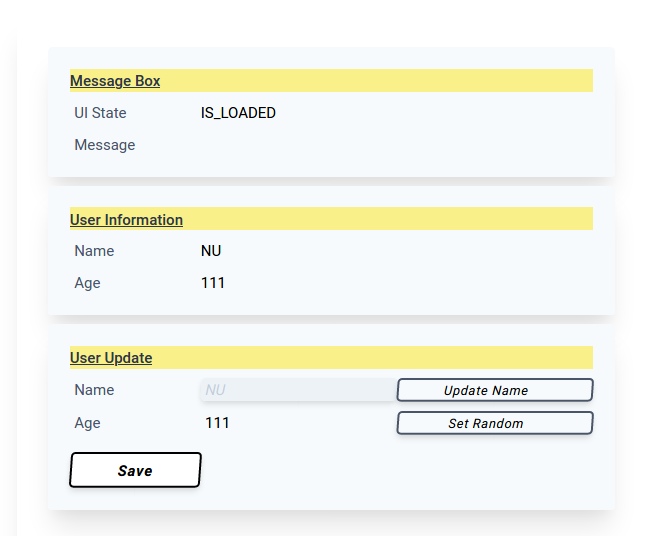
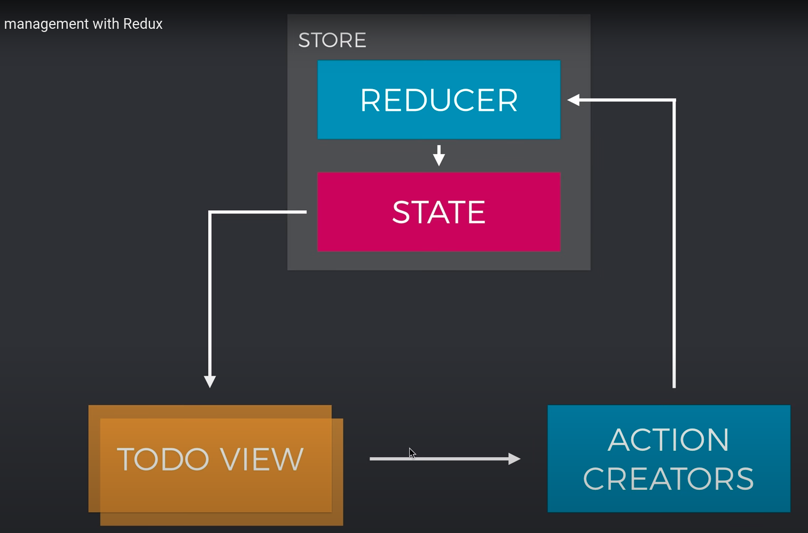

# User Management App

## UI



## Let CSS pierce globally through LitElement

LitElement, and therefore Polymer, is per standard working with the Shadow Dom. But, the Shadow Dom prevents to use global CSS. And global CSS, like in the context of this project, is prefered with the usage of `tailwind-css`.

Accepted, while not officially supported solution, is to not create a shadow on the element. For the how-to, see the class `src/views/NonShadowLitElement.ts`.

## Get new value after property change on LitElement

Here you can see a dynamic access to a LitElement property by key, `this[propNameLitElmPrefixed]`. As discovered, the property name is not as given by the parameter. As discovered, the parameter name must be prefixed with a `__`.

The dynamic access itself is implemented by array access by key. For `hasKey2` see the "How to generalize a value-by-key-of-object-lookup" section, heading 4.

```ts
    updated(changedProperties: Map<string, any>) {
		changedProperties.forEach((oldval: any, propName: string) => {
			let newval: any = "???"
			let propNameLitElmPrefixed = "__" + propName
			if (hasKey2(this, propNameLitElmPrefixed)) {
				newval = this[propNameLitElmPrefixed]
			}
			console.log(
				`property >${propName}< changed. oldValue: ${oldval}, newval: ${newval}`,
			)
		})
	}
```

## Convince prettier to display:inline of HTML Tags

```html
		<!-- display: inline --><div
			class="inline-block mt-2 pl-1 w-1/4 text-gray-700"
			>Name</div
		><!-- display: inline --><div class="in...
```

## Rest Conventions


## Use validation of objects for external APIS

See https://blog.logrocket.com/dynamic-type-validation-in-typescript/#:~:text=There%20is%20no%20doubt%20that,is%20possible%20given%20its%20type

```bash
yarn run typescript-json-validator --useNamedExport src/types/external/!\\(*validator.ts\\)
```

```ts
import { default as validateUserProps } from "./types/external/UserProps.validator"
...
// (alias) validateUserProps(value: unknown): UserProps
validateUserProps(rs.data)
```

## Lit-html References

- https://open-wc.org/developing/best-practices.html
- [lit-html & lit-element: intermediatet tutorials](https://open-wc.org/codelabs/intermediate/lit-html.html?index=/codelabs/#0)
- https://open-wc.org/developing/code-examples.html

  - Basic
  - Intermediate
  - Advanced

- https://vaadin.com/learn/tutorials/lit-element/state-management-with-redux

## Redux integration

The Redux store is built according to standard procedure as can be seen in



Let's start with the State-to-View Connection.

### State-to-View Connection

The View is coupled with the Store by the `connect` function, which is provided by package `pwa-helpers`. For usage in the `connect` method, the base class `src/views/NonShadowLitElement.ts` must not be abstract.

With that function comes a `stateChanged` method, which is called whenever the state is changed.

```ts
import { store } from "../store"
...
export class UserForm extends connect(store)(NonShadowLitElement) {
    ...
    stateChanged(store: AppState) {
		this.name = store.data.theUser?.name || "xxx"
		this.age = store.data.theUser?.age || 1
    }
    ...
}
```

### View-to-Action Connection

### Action-To-Reducer Connection

### Reducer-To-State Connection

## How to generalize a value-by-key-of-object-lookup

Different value-by-key-of-object-lookup strategies are implemented in `src/Utils.ts`.

Overall, solution 3 and 4 are prefered.

### 1

A TS-compile-time-check only solution

```ts
export class Attributes<T> {
    ...
    get = (propName: keyof T) => {
        return this.data[propName]
    }
```

- (~) no runtime check
- (~) generic involved
- (-) has to be called by `get(propName as keyof UserProps)`

### 2

A TS-compile-time-check only solution

```ts
// src/Attributes.ts
export class Attributes<T> {
    ...
    get = <K extends keyof T>(key: K): T[K] => {
        return this.data[key]
    }
}
```

- (~) no runtime check
- (~) generic involved
- (+) no has-to-called instructions

### 3

A TS-compile-time-check AND at runtime `key in obj` solution.

Narrowed Return Types are

- `this.data` becomes `Attributes<T>.data: T`
- `propName` becomes `string & keyof T`

```ts
get = (propName: string) => {
	if (hasKey(this.data, propName)) {
		return this.data[propName]
	}
}
```

- (+) with runtime check
- (+) No generic involved
- (+) no has-to-called instructions

### 4

A TS-compile-time-check AND at runtime `hasOwnProperty` solution.

Narrowed Return Types are

- `this.data` becomes `Attributes<T>.data: T`
- `propName` becomes `string & keyof T`

```ts
get = (propName: string) => {
	if (hasKey2(this.data, propName)) {
		return this.data[propName]
	}
}
```

- (+) with runtime check
- (+) No generic involved
- (+) no has-to-called instructions
