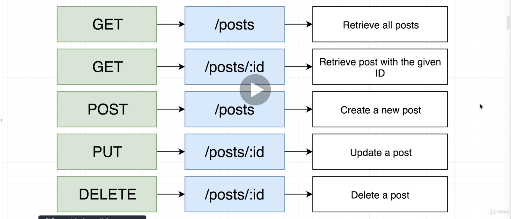

# User Management App

## Rest Conventions



## Use validation of objects for external APIS

See https://blog.logrocket.com/dynamic-type-validation-in-typescript/#:~:text=There%20is%20no%20doubt%20that,is%20possible%20given%20its%20type

```bash
yarn run typescript-json-validator --useNamedExport src/types/external/!\\(*validator.ts\\)
```

```ts
import { default as validateUserProps } from "./types/external/UserProps.validator"
...
// (alias) validateUserProps(value: unknown): UserProps
validateUserProps(rs.data)
```

## How to generalize a value-by-key-of-object-lookup

### 1

TS-compile-time-check only solution

```ts
export class Attributes<T> {
    ...
    get = (propName: keyof T) => {
        return this.data[propName]
    }
```

- (~) no runtime check
- (~) generic involved
- (-) has to be called by `get(propName as keyof UserProps)`

### 2

TS-compile-time-check only solution

```ts
// src/Attributes.ts
export class Attributes<T> {
    ...
    get = <K extends keyof T>(key: K): T[K] => {
        return this.data[key]
    }
}
```

- (~) no runtime check
- (~) generic involved
- (+) no has-to-called instructions

### 3

At runtime `key in obj` solution.

Narrowed Return Types are

- `this.data` becomes `Attributes<T>.data: T`
- `propName` becomes `string & keyof T`

```ts
get = (propName: string) => {
	if (hasKey(this.data, propName)) {
		return this.data[propName]
	}
}
```

- (+) with runtime check
- (+) No generic involved
- (+) no has-to-called instructions

### 4

At runtime `hasOwnProperty` solution.

Narrowed Return Types are

- `this.data` becomes `Attributes<T>.data: T`
- `propName` becomes `string & keyof T`

```ts
get = (propName: string) => {
	if (hasKey2(this.data, propName)) {
		return this.data[propName]
	}
}
```

- (+) with runtime check
- (+) No generic involved
- (+) no has-to-called instructions
