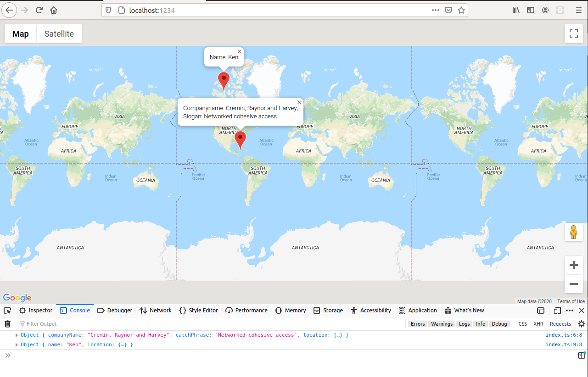

# Google Maps App

See https://www.udemy.com/course/typescript-the-complete-developers-guide, section 9 "Design Patterns with Typescript".

## The Google Maps App UI

A google map displaying two markers. Each does have an info window.

The app is written in Typescript, provisioned with yarn and provided by Parcel.



## Provide the Google Maps API key to the application

Before running yarn start, see to it so that the environment variable DMYTSCMPLDVGMAPSAPIKEY is set to your Google Maps API key

```bash
joma@edison:typescript-compldevguide (google-maps-app*%=) $ export DMYTSCMPLDVGMAPSAPIKEY=YourGoogleMapsAPIKey
joma@edison:typescript-compldevguide (google-maps-app*%=) $ yarn start
yarn run v1.22.4
$ parcel index.html
Server running at http://localhost:1234
✨  Built in 567ms.
```

Check your browser console - if you see some console log like

```js
...Google Maps JavaScript API error: InvalidKeyMapError...
```

surely something has gone wrong.

The Google Maps API key is delivered by a variable replacement on the HTML `.\index.html` file. The replacement is done via the `posthtml-expressions` plugin, which - as of https://parceljs.org/html.html - is part of parcel's feature _PostHTML_ plugin chain.

`posthtml-expressions` plugin's replacment pattern in HTML are mustaches, as in `{{ DMYTSCMPLDVGMAPSAPIKEY }}`. Keys stem from the `posthtml-expressions` section of `.\posthtml.config.js`, which must be provisioned with adequate values too.

> ! Note that on change of a value of an environment variable, one must bust the parcel cache. That is, delete the folder `.\cache`.

### Source Map in Firefox not working

See https://github.com/parcel-bundler/parcel/issues/2209.

Hence, in package.json, set `—public-url` to `./`

```json
"start": "parcel —public-url ./ index.html"
```
